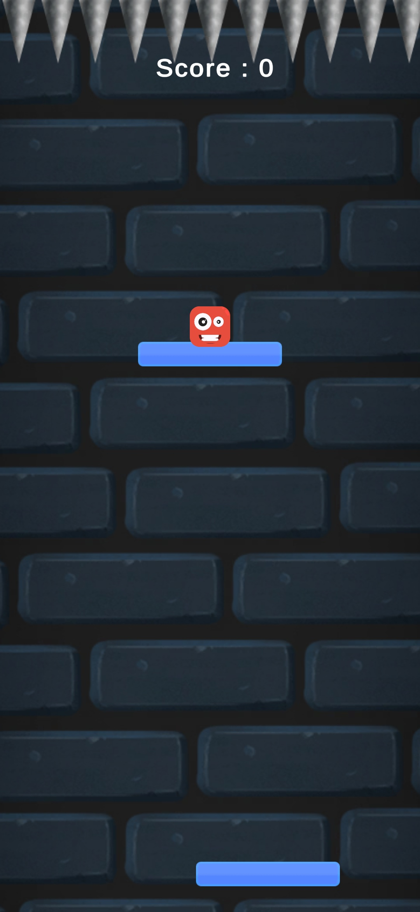

# 🎮 Cube Fall

Cube Fall is a fast-paced, addictive Android arcade game where you guide a falling cube by tapping the left or right side of the screen. Avoid deadly obstacles, collect shining stars, and enjoy a minimalistic experience with immersive background music! 🎧✨

---

## 📱 Gameplay Overview

- Tap **left side** of the screen to move the cube **left**
- Tap **right side** to move **right**
- **Dodge obstacles** and survive as long as you can
- **Collect stars** to increase your score
- Speed and difficulty increase over time
- Relaxing yet energizing **music tracks** accompany your journey 🎵

---

## ✨ Key Features

✅ Smooth touch controls  
✅ Minimalistic UI  
✅ Addictive endless gameplay  
✅ Dynamic obstacles & increasing challenge  
✅ Collectible stars for points  
✅ High-quality background **music**  
✅ Lightweight APK optimized for Android

---

## 📸 Screenshot

---

## 🎧 Music & Sound

Cube Fall includes background music tracks that:
- Enhance focus and rhythm
- Change intensity as difficulty increases
- Are royalty-free or originally composed 🎶

---

## 🛠️ Tech Stack

- Game Engine: **Unity** (or your choice)
- Programming Language: **C#**
- Platform: **Android**
- Audio: Unity Audio System (WAV/MP3)

---

## 🚀 Upcoming Features

- 🎮 Power-ups (shield, slow-mo)
- 🌎 Online leaderboard integration
- 🎨 More visual themes (dark, neon, glow)
- 📊 High-score saving
- 📲 Google Play Store release

---

> If you enjoyed Cube Fall, ⭐ star this repo and share it with friends!
